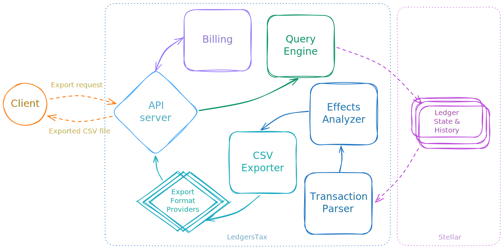

# LedgersTax

> Export your Stellar transactions history for tax reporting. Even on the moon, you still have to file taxes.

LedgersTax loads transactions information from Stellar history for any period for the last ten years.
We plan to provide tax reports in formats compatible with Koinly, BitcoinTax, Recap, Cryptotax, Awaken, CoinLedger, CoinPanda, KoinX, TurboTax, and other tax reporting software.

🛠️ Under development, stay tuned! 🚧

## Technical Architecture

- **API Server and Website**  
  The website provides a form for data export. Exported files are generated on the backend accessible via REST API.
- **Query Engine**  
  Generates queries to fetch relevant transactions data from Stellar history.
- **Transaction Parser**  
  Extracts legder state changes from binary trasaction and meta XDR.
- **Effects Analyzer**  
  Aggreagtes changes supplied by the parser and converts them into human-readable data suiatbel for further analysis and tax reporting.
- **CSV Exporter**  
  Assembels output files in CSV or XSLX format.
- **Export Format Providers**  
  Control output filed names and data representation to generate files compatible with popular tax reporting software.
- **Billing Module**  
  Manages authentication and payments for accounts with substantial transactions activity and enterprise customers.
